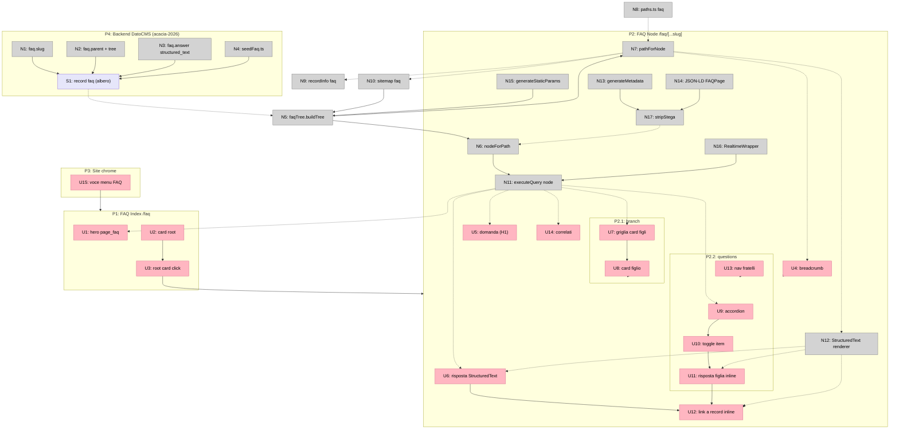

# Sezione FAQ — Slices

**Stato:** Sliced · **Branch:** `feat/faq` · Deriva da [`faq-section.md`](./faq-section.md) (Shape A)

Breadboard di Shape A + slice verticali demo-abili. Ogni slice finisce in UI dimostrabile. I riferimenti `A1…A7` sono le parti della Shape A.

---

## Places

| #    | Place                            | Descrizione                                                          |
| ---- | -------------------------------- | -------------------------------------------------------------------- |
| P1   | FAQ Index (`/faq`)               | Singleton `page_faq` (hero) + card dei nodi radice                   |
| P2   | FAQ Node Page (`/faq/[...slug]`) | Pagina di un nodo: rendering condizionale branch vs questions        |
| P2.1 | Node — modalità _branch_         | Subplace: il nodo ha figli-sezione → griglia di card                 |
| P2.2 | Node — modalità _questions_      | Subplace: i figli sono domande → accordion Q&A inline + nav fratelli |
| P3   | Site chrome (Header/Footer)      | Navigazione esistente (voce FAQ)                                     |
| P4   | Backend DatoCMS (CDA/CMA)        | Schema `faq` + record (env `acacia-2026`)                            |

---

## UI Affordances

| #   | Place | Component         | Affordance                                   | Control | Wires Out          | Returns To |
| --- | ----- | ----------------- | -------------------------------------------- | ------- | ------------------ | ---------- |
| U1  | P1    | FaqIndex          | hero `page_faq` (title/subtitle/intro/image) | render  | —                  | ← N11      |
| U2  | P1    | FaqIndex          | griglia card root (PRIMA/DURANTE/DOPO)       | render  | → U3               | ← N5       |
| U3  | P1    | FaqRootCard       | card root                                    | click   | → P2               | —          |
| U4  | P2    | FaqBreadcrumb     | breadcrumb antenati                          | click   | → P2               | ← N7       |
| U5  | P2    | FaqNode           | domanda del nodo (H1)                        | render  | —                  | ← N11      |
| U6  | P2    | FaqNode           | risposta del nodo (StructuredText)           | render  | → U12              | ← N12      |
| U7  | P2.1  | FaqChildrenGrid   | griglia card figli                           | render  | → U8               | ← N11      |
| U8  | P2.1  | FaqChildCard      | card figlio                                  | click   | → P2               | —          |
| U9  | P2.2  | FaqAccordion      | lista accordion domande figlie               | render  | → U10              | ← N11      |
| U10 | P2.2  | FaqAccordionItem  | toggle item                                  | click   | → U11              | —          |
| U11 | P2.2  | FaqAccordionItem  | risposta figlia inline (StructuredText)      | render  | → U12              | ← N12      |
| U12 | P2    | StructuredText    | link a record inline (faq/post/page)         | click   | → P2 / altra route | ← N12      |
| U13 | P2.2  | FaqSiblings       | nav fratelli                                 | click   | → P2               | ← N5       |
| U14 | P2    | FaqRelated        | correlati (services/posts dalle relazioni)   | render  | → altra route      | ← N11      |
| U15 | P3    | SiteHeader/Footer | voce menu FAQ                                | click   | → P1               | —          |

---

## Non-UI Affordances

| #   | Place | Component         | Affordance                                                                | Control | Wires Out     | Returns To               | Parte |
| --- | ----- | ----------------- | ------------------------------------------------------------------------- | ------- | ------------- | ------------------------ | ----- |
| N1  | P4    | migration         | `faq.slug` (slug, **localizzato**, auto da question)                      | schema  | —             | —                        | A1    |
| N2  | P4    | migration         | `faq.parent` (self-link) + `tree: true`                                   | schema  | —             | —                        | A1    |
| N3  | P4    | migration         | `faq.answer` → `structured_text` (allowlist link faq/post/page, no block) | schema  | —             | —                        | A1    |
| N4  | P4    | seedFaq.ts (CMA)  | seed root+sotto-temi, assegna parent/slug/position, html→DAST 26 risposte | invoke  | → S1          | —                        | A2    |
| N5  | P2/P1 | faqTree.ts        | `buildTree()` (query flat `allFaqs{id slug parent{id}}` + ricostruzione)  | call    | → N6, → N7    | ← S1                     | A3    |
| N6  | P2    | faqTree.ts        | `nodeForPath(slugs[], locale)` resolver (valida ancestry)                 | call    | → N11         | ← N5                     | A3    |
| N7  | P2    | faqTree.ts        | `pathForNode(nodeId, locale)` (ancestry → catena di slug)                 | call    | —             | → U4, → N9, → N10, → N12 | A3    |
| N8  | P2    | paths.ts          | segmento `faq` + helper path FAQ                                          | call    | —             | → N7                     | A3    |
| N9  | P4→FE | recordInfo.ts     | ramo `faq`: URL gerarchico via `pathForNode` (Web Previews / SEO plugin)  | call    | → N7          | → preview-links/seo      | A3/A7 |
| N10 | —     | sitemap.ts        | entry FAQ (tutti i path × locale)                                         | call    | → N5          | —                        | A5    |
| N11 | P2    | page.tsx          | `executeQuery` node (question, answer, children, siblings, \_seoMetaTags) | call    | → U5,U6,U7,U9 | ← S1                     | A4    |
| N12 | P2    | FaqStructuredText | renderer `react-datocms` (renderInlineRecord/renderLinkToRecord)          | call    | → U6,U11,U12  | ← N7                     | A4    |
| N13 | P2    | page.tsx          | `generateMetadata` (\_seoMetaTags + alternates canonical/languages)       | call    | —             | → <head>                 | A5    |
| N14 | P2    | FaqJsonLd         | JSON-LD `FAQPage` (da Q&A, `stripStega`)                                  | call    | → N17         | → <head>                 | A5    |
| N15 | P2    | page.tsx          | `generateStaticParams` (tutti i path dell'albero × locale)                | call    | → N5          | —                        | A3    |
| N16 | P2    | RealtimeWrapper   | `RealtimeWrapper` + `getDraftRealtimeOptions` (draft live)                | call    | → N11         | —                        | A7    |
| N17 | P2    | stega             | `stripStega` (confronto slug, JSON-LD, meta)                              | call    | —             | → N6, → N14              | A7    |

### Data Store

| #   | Place | Store                                                                                                | Parte |
| --- | ----- | ---------------------------------------------------------------------------------------------------- | ----- |
| S1  | P4    | record `faq` (albero: question, answer DAST, parent, slug, position, services, posts, \_seoMetaTags) | A2    |

---

## Breadboard (Mermaid)

---

## Slice Summary

| #   | Slice                                   | Parti                | Affordances                                                                    | Demo                                                                                                   |
| --- | --------------------------------------- | -------------------- | ------------------------------------------------------------------------------ | ------------------------------------------------------------------------------------------------------ |
| V1  | Ramo DURANTE navigabile end-to-end (EN) | A1, A2(parz), A3, A4 | N1,N2,N3,N4*,N5,N6,N7,N8,N11,N12*,N15 · U1,U2,U3,U4,U5,U6,U7,U8,U9,U10,U11,U13 | "Naviga /faq → DURANTE → sezione (card) → foglia (accordion Q&A) con breadcrumb e fratelli, su mobile" |
| V2  | Link interni nelle risposte             | A4                   | N9, N12(full) · U12                                                            | "Una risposta linka a un'altra FAQ / un post / una pagina, cliccabile e naviga"                        |
| V3  | Contenuti completi: tutti i rami (EN)   | A2(full)             | N4(full), S1 popolato · U14                                                    | "L'intero albero reale (PRIMA/DURANTE/DOPO) navigabile; 26 risposte migrate; correlati"                |
| V4  | SEO + sitemap + menu                    | A5, A6               | N10,N13,N14,N17 · U15                                                          | "FAQ nel menu; meta corretti per nodo; /sitemap.xml include le FAQ; rich result FAQPage"               |
| V5  | Draft mode / realtime / visual editing  | A7                   | N16, N9(finalize), N17(reuse)                                                  | "In draft un editor vede la preview live e gli overlay click-to-edit sulle FAQ"                        |

`*` = versione parziale nello slice (seed solo DURANTE in V1; renderer StructuredText senza link inline in V1).

### Dipendenza esterna (non è uno slice)

- **Contenuto IT** — 20/26 risposte italiane da scrivere + traduzioni question/slug/intro dei nodi. Workstream di Diana, in parallelo. Il codice è bilingue da V1; l'IT si popola via CMS senza rebuild.

---

## Slice Diagram (Mermaid)

```mermaid
flowchart TB
    subgraph V1["V1: DURANTE end-to-end"]
        N1["N1: faq.slug"]
        N2["N2: faq.parent+tree"]
        N3["N3: answer structured_text"]
        N4["N4: seed (DURANTE)"]
        N5["N5: faqTree.buildTree"]
        N6["N6: nodeForPath"]
        N7["N7: pathForNode"]
        N8["N8: paths.ts faq"]
        N11["N11: executeQuery node"]
        N12["N12: StructuredText (base)"]
        N15["N15: generateStaticParams"]
        U1["U1: hero"]
        U2["U2: card root"]
        U3["U3: root click"]
        U4["U4: breadcrumb"]
        U5["U5: domanda"]
        U6["U6: risposta"]
        U7["U7: card figli"]
        U8["U8: card figlio"]
        U9["U9: accordion"]
        U10["U10: toggle"]
        U11["U11: risposta inline"]
        U13["U13: fratelli"]
    end

    subgraph V2["V2: Link interni"]
        N9["N9: recordInfo faq"]
        U12["U12: link record inline"]
    end

    subgraph V3["V3: Contenuti completi"]
        N4f["N4: seed full (26)"]
        U14["U14: correlati"]
    end

    subgraph V4["V4: SEO + menu"]
        N10["N10: sitemap"]
        N13["N13: generateMetadata"]
        N14["N14: JSON-LD FAQPage"]
        N17["N17: stripStega"]
        U15["U15: menu FAQ"]
    end

    subgraph V5["V5: Draft / realtime"]
        N16["N16: RealtimeWrapper"]
    end

    U2 --> U3 --> P2ref["→ node page"]
    U7 --> U8
    U9 --> U10 --> U11
    U6 --> U12
    U15 --> U1
    N5 --> N6 --> N11
    N5 --> N7
    N7 -.-> N9
    N7 -.-> N10
    N16 --> N11
    N13 --> N17
    N14 --> N17

    style V1 fill:#e8f5e9,stroke:#4caf50,stroke-width:2px
    style V2 fill:#e3f2fd,stroke:#2196f3,stroke-width:2px
    style V3 fill:#fff3e0,stroke:#ff9800,stroke-width:2px
    style V4 fill:#f3e5f5,stroke:#9c27b0,stroke-width:2px
    style V5 fill:#fff8e1,stroke:#ffc107,stroke-width:2px
    classDef ui fill:#ffb6c1,stroke:#d87093,color:#000
    classDef nonui fill:#d3d3d3,stroke:#808080,color:#000
    class U1,U2,U3,U4,U5,U6,U7,U8,U9,U10,U11,U12,U13,U14,U15 ui
    class N1,N2,N3,N4,N4f,N5,N6,N7,N8,N9,N10,N11,N12,N13,N14,N15,N16,N17 nonui
```

---

## Note di implementazione per slice

- **V1** è lo slice più pesante (porta schema + routing + render insieme: non c'è UI demo-abile prima). Tienilo stretto: seed solo del ramo DURANTE con 2-3 FAQ reali, renderer StructuredText base (paragrafi/liste/marks, senza link inline). Riferimento: `florence/districts/[slug]` per pattern `executeQuery`/`generateStaticParams`/`generateMetadata`.
- **V1 design**: applicare la skill `acacia-design-system` (accordion mobile-first, card root, breadcrumb, label fasi).
- **Ordine consigliato**: V1 → V2 → V3 → V4 → V5. V4/V5 possono procedere mentre Diana popola i contenuti.
- **Tutto DatoCMS via CLI** (migrazione schema + script seed), env `acacia-2026`, mai MCP.

---

## V1 — Stato: implementato ✅ (2026-06-01)

Schema, contenuto del ramo e tutto il rendering funzionano end-to-end (verificato in dev su `/en/faq`, `/it/faq`, nodi branch/accordion/leaf, 404).

**File creati/modificati:**

- `scripts/faq/01-schema.mjs` — migrazione schema (CMA, idempotente)
- `scripts/faq/02-seed-durante.mjs` — seed nodi radice + sotto-temi
- `scripts/faq/03-content-durante.mjs` — slug + `answer` HTML→`answer_structured` DAST
- `src/lib/faq/faqTree.ts` — fetch flat + tree helpers (resolve/breadcrumb/siblings/path)
- `src/app/[locale]/faq/[[...slug]]/page.tsx` — catch-all (index + node), staticParams, metadata
- `src/components/Faq/` — `answerFragment.ts`, `FaqStructuredText.tsx`, `FaqAccordion.tsx`, `FaqBreadcrumb.tsx`, `FaqCard.tsx`
- `src/i18n/paths.ts` — segmento `faq` + `faqPath()`

**Gotcha incontrati (per V3/futuri):**

1. **`tree: true` = parent/children nativi** — niente campo `parent` custom.
2. **`answer` non cambia tipo** → nuovo campo `answer_structured`; il vecchio `answer` resta legacy.
3. **Set parent via CMA**: permesso in `create` ma **non in `update`** (`relationships.parent` rifiutato). Per spostare record esistenti → UI drag-and-drop (fatto da Matteo per V1) o ricreazione. Da risolvere per V3 (≈20 FAQ).
4. **Campi localizzati in update**: fornire **tutte** le locale, altrimenti l'API interpreta come "rimuovi locale".
5. **HTML→DAST** in Node: usare `parse5ToStructuredText(parse(html))` (non `htmlToStructuredText`, che richiede DOMParser). Liste/marks preservati; link esterni appiattiti.
6. **`react-datocms`**: importare `StructuredText` da `react-datocms/structured-text` (il barrel tira dentro `VideoPlayer` → "module not found"). `stripStega` non è esportato in questa versione (gli slug non ne hanno bisogno).
7. Rigenerare anche **`gql.tada generate output`** (oltre a `generate-schema`/`generate-cma-types`), altrimenti i tipi delle query nuove sono `{}`/`never`.

**Da rifinire (non bloccante):** slug lunghi (auto da question) — accorciabili in UI; voce di menu (V4); il ramo DURANTE ha sia FAQ dirette sia 2 sotto-temi vuoti (`getting-here`/`check-in`) → decidere struttura con Diana.

---

## V2 — Stato: implementato ✅ (2026-06-01)

Link interni nelle risposte (Structured Text → record faq/post/page). Verificato: la FAQ "door numbers" mostra "See also: driving & parking" con href gerarchico corretto verso un'altra FAQ (cross-ramo).

**Modifiche:**

- `src/components/Faq/answerFragment.ts` — aggiunto `links { ... on FaqRecord/PostRecord/PageRecord }`
- `src/components/Faq/FaqStructuredText.tsx` — `renderLinkToRecord` + `renderInlineRecord`; href via mappa `faqHrefById` (FAQ, ancestry-aware) e `modelPath` (post/page); nuove prop `faqHrefById`/`locale`
- `FaqAccordion.tsx` + `page.tsx` — costruiscono e propagano `faqHrefById`
- `scripts/faq/04-demo-link.mjs` — itemLink dimostrativo; `scripts/faq/05-publish.mjs` — publish

**Gotcha aggiuntivi (V2):**

8. **`faq.draft_mode_active: true`** — gli update CMA creano **bozze** non pubblicate; la CDA pubblicata (sito in non-draft) vede la versione vecchia. → gli script di migrazione devono **pubblicare** dopo le write (`scripts/faq/05-publish.mjs`). Vale per V3.
9. **Localizzazione campi diversa per modello**: `Faq` e `Page` hanno `slug`/`title` localizzati (arg `locale`), `Post` **no**. Nel fragment dei link niente `locale` su `PostRecord`.
10. **Next Data Cache** (`force-cache` + tag `datocms`) persiste su `.next/cache` tra i restart: dopo un publish/cambio CDA, in dev serve `rm -rf .next` o l'endpoint `/api/invalidate-cache` per vedere i nuovi contenuti.

---

## V3 — Stato: contenuti completi ✅ (2026-06-01)

Tutti e 3 i rami navigabili con contenuto reale. Operazione prevalentemente **dati** (il rendering gestiva già alberi arbitrari): nessun cambio frontend.

- `scripts/faq/06-content-all.mjs` — per ogni faq senza `answer_structured`: imposta `slug` (en/it) + converte `answer` HTML→DAST (en/it), poi pubblica. **Salta** i record già fatti (preserva il link demo V2). Risultato: 20 convertiti, 11 saltati, tutti pubblicati (31 record).
- Parent dell'albero: già impostati in UI da Matteo (tutti e 3 i rami).
- Verificato: PRIMA (accordion 16), DOPO (accordion 4), leaf con risposta + nav fratelli, IT, link interno V2 intatto.

**Rimanenti V3 (non bloccanti):** `U14` correlati (services/posts) non ancora reso; set-parent via API per record esistenti non risolto (oggi via UI) — entrambi rimandabili.

---

## V4 — Stato: SEO + sitemap + aggancio menu ✅ (2026-06-01)

- `page.tsx generateMetadata` — `_seoMetaTags` (toNextMetadata) per index e nodo + `alternates` canonical/**languages** con slug per-lingua corretti (es. `en/faq/before-booking` ↔ `it/faq/prima-di-prenotare`)
- **JSON-LD `FAQPage`** sulle pagine accordion (Question/Answer da `dastToText`, `src/lib/faq/dastText.ts` strip zero-width)
- `src/app/sitemap.ts` — entry FAQ gerarchiche per locale
- `src/lib/datocms/recordInfo.ts` — ramo `faq`: URL gerarchico via `fetchFaqTree`+`pathForNode` (Web Previews / SEO plugin)
- `src/i18n/paths.ts` — `page_faq` → `/faq` in `indexPaths`

**Editoriale (non codice):** la **voce di menu** è guidata da DatoCMS (`app.navItems`) → aggiungere in CMS un MenuItem che punta alla pagina `page_faq`.
