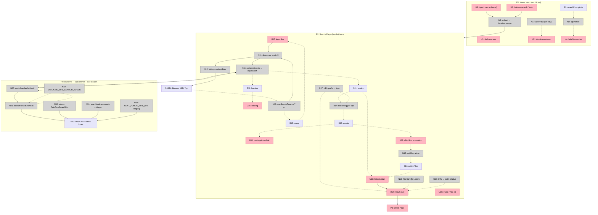

# Home Search — Breadboard (Detail A) + Slices

Implementazione di **Shape A** (vedi `home-search.md`). Le tabelle sono la verità; il Mermaid è una visualizzazione.

## Places

| #   | Place                                              | Description                                                |
| --- | -------------------------------------------------- | ---------------------------------------------------------- |
| P1  | Home Hero (modificato)                             | Titolo con `<em>` wonky + `SearchBox` al posto dei bottoni |
| P2  | Search Page `/{locale}/cerca` · `/search` (nuova)  | Ricerca live + filtri/contatori + risultati                |
| P3  | Detail Page (apartment/district/mood/faq/magazine) | Target di navigazione dei risultati                        |
| P4  | Backend — `/api/search` + DatoCMS Site Search      | Route handler proxy + indice crawled                       |

## UI Affordances

| #   | Place | Component  | Affordance                                              | Control                        | Wires Out        | Returns To |
| --- | ----- | ---------- | ------------------------------------------------------- | ------------------------------ | ---------------- | ---------- |
| U1  | P1    | Hero       | Titolo con parola in `<em>`                             | render                         | —                | —          |
| U2  | P1    | Hero       | Sfondo wonky dietro l'`<em>`                            | render (wipe-in su `.in-view`) | —                | —          |
| U3  | P1    | SearchBox  | Input ricerca (home)                                    | type                           | → N3 (su submit) | —          |
| U4  | P1    | SearchBox  | Label typewriter (prompt ciclici)                       | render                         | —                | —          |
| U5  | P1    | SearchBox  | Bottone "search" / Invio                                | click                          | → N3             | —          |
| U10 | P2    | SearchPage | Input ricerca (live)                                    | type                           | → N11            | —          |
| U11 | P2    | SearchPage | Conteggio risultati                                     | render                         | —                | —          |
| U12 | P2    | SearchPage | Chip filtro (Tutti + 5 tipi) + contatori                | click                          | → N15            | —          |
| U13 | P2    | SearchPage | Lista risultati                                         | render                         | → U14            | —          |
| U14 | P2    | ResultCard | Card (kicker-tipo, titolo+highlight, excerpt+highlight) | click                          | → P3             | —          |
| U15 | P2    | SearchPage | Stato loading                                           | render                         | —                | —          |
| U16 | P2    | SearchPage | Stato vuoto / hint "≥3 caratteri"                       | render                         | —                | —          |

## Code Affordances

| #   | Place | Component      | Affordance                                                                                         | Control | Wires Out    | Returns To   |
| --- | ----- | -------------- | -------------------------------------------------------------------------------------------------- | ------- | ------------ | ------------ |
| N1  | P1    | Hero           | `useInView` ref (aggiunge `.in-view`)                                                              | observe | → U2         | —            |
| N2  | P1    | SearchBox      | typewriter (cicla prompt da S1; `prefers-reduced-motion`)                                          | call    | → U4         | —            |
| N3  | P1    | SearchBox      | submit → `window.location.assign('/{locale}/cerca?q=')`                                            | call    | → P2         | —            |
| N10 | P2    | SearchPage     | `useSearchParams` in `Suspense`: legge `?q=` iniziale                                              | read    | → N11        | → S10        |
| N11 | P2    | SearchPage     | input handler + debounce ~250ms + min 3 char                                                       | call    | → N12, → N13 | → S10        |
| N12 | P2    | SearchPage     | `history.replaceState('?q=')`                                                                      | call    | → S-URL      | —            |
| N13 | P2    | SearchPage     | `performSearch(q, locale)` → fetch `/api/search`                                                   | call    | → N20        | → S11, → S12 |
| N14 | P2    | SearchPage     | bucketing risultati per tipo (via N17)                                                             | call    | —            | → S13        |
| N15 | P2    | SearchPage     | set filtro attivo                                                                                  | call    | → S14        | —            |
| N16 | P2    | lib/highlight  | converte `[h]…[/h]` → `<mark>`                                                                     | call    | —            | → U14        |
| N17 | P2    | lib/searchType | URL prefix → tipo (apartment/district/mood/faq/magazine)                                           | call    | —            | → N14, → U14 |
| N18 | P2    | lib/url        | rewrite URL assoluto → path relativo                                                               | call    | —            | → U14        |
| N20 | P4    | `/api/search`  | route handler (q, locale): fetch-all (cap 100) + normalize                                         | call    | → N21        | → N13        |
| N21 | P4    | DatoCMS        | `searchResults.rawList({filter:{query,fuzzy,search_index_id,locale}, page})` + `listPagedIterator` | call    | → S20        | → N20        |
| N22 | P4    | env            | `DATOCMS_SITE_SEARCH_TOKEN` (ruolo `can_perform_site_search`, server-side)                         | config  | —            | → N21        |
| N30 | P4    | `robots.ts`    | gruppo `DatoCmsSearchBot`: Allow 5 pattern detail (×locale) prima di `Disallow: /`                 | config  | → S20        | —            |
| N31 | P4    | one-shot CMA   | `searchIndexes.create({enabled, frontend_url})` + `trigger(id)`                                    | call    | → S20        | —            |
| N32 | P4    | env (staging)  | `NEXT_PUBLIC_SITE_URL = https://acacia-2026.vercel.app` (sitemap on-domain)                        | config  | → S20        | —            |

## Data Stores

| #     | Place   | Store                                   | Description / chi legge                |
| ----- | ------- | --------------------------------------- | -------------------------------------- |
| S1    | P1      | `searchPrompts.ts` (EN/IT, ~10 domande) | letto da N2 → U4                       |
| S10   | P2      | `query`                                 | scritto da N10/N11; letto da N13, U10  |
| S11   | P2      | `results` (flat)                        | scritto da N13; letto da N14, U13      |
| S12   | P2      | `loading`                               | scritto da N13; letto da U15           |
| S13   | P2      | `counts` (per tipo)                     | scritto da N14; letto da U11, U12      |
| S14   | P2      | `activeFilter`                          | scritto da N15; filtra U13/U14         |
| S-URL | Browser | URL `?q=`                               | scritto da N12; letto da N10           |
| S20   | P4      | DatoCMS Search Index (pagine crawled)   | costruito da N30/N31/N32; letto da N21 |

## Mermaid

---

## Slices

| #   | Slice                           | Mechanism         | Affordances                                                                    | Demo                                                                                                   |
| --- | ------------------------------- | ----------------- | ------------------------------------------------------------------------------ | ------------------------------------------------------------------------------------------------------ |
| V1  | Backend + pagina ricerca minima | A1, A2, A3 (core) | N30, N31, N32, N22, N20, N21, S20, U10, U13, U14, N11, N13, N16, N18, S10, S11 | "Su `/cerca` digito 'firenze' → risultati reali con highlight; clic → pagina di dettaglio (in locale)" |
| V2  | Filtri + contatori              | A3 (facet)        | U11, U12, N14, N15, N17, S13, S14                                              | "I risultati si contano per tipo; i chip filtrano (Appartamenti 5, FAQ 8…)"                            |
| V3  | Hero: SearchBox + typewriter    | A4, A5, A6        | U3, U4, U5, N2, N3, S1                                                         | "In home, sotto il titolo, l'input con domande che si digitano; Invio → `/cerca`"                      |
| V4  | `<em>` wonky + stati + URL      | A7 + rifiniture   | U1, U2, N1, U15, U16, N10, N12, S-URL                                          | "La parola in `<em>` ha lo sfondo wonky animato; stati vuoto/loading; `?q=` condivisibile"             |

### V1 — Backend + pagina ricerca minima

| #   | Component     | Affordance                                          | Control | Wires Out | Returns To |
| --- | ------------- | --------------------------------------------------- | ------- | --------- | ---------- |
| N30 | `robots.ts`   | gruppo `DatoCmsSearchBot` (Allow detail / Disallow) | config  | → S20     | —          |
| N32 | env staging   | `NEXT_PUBLIC_SITE_URL`                              | config  | → S20     | —          |
| N31 | one-shot CMA  | `searchIndexes.create` + `trigger`                  | call    | → S20     | —          |
| N22 | env           | `DATOCMS_SITE_SEARCH_TOKEN` (ruolo dedicato)        | config  | —         | → N21      |
| N21 | DatoCMS       | `searchResults.rawList` + `listPagedIterator`       | call    | → S20     | → N20      |
| N20 | `/api/search` | route handler fetch-all + normalize                 | call    | → N21     | → N13      |
| N13 | SearchPage    | `performSearch(q, locale)`                          | call    | → N20     | → S11      |
| N11 | SearchPage    | debounce + min 3 char                               | call    | → N13     | → S10      |
| U10 | SearchPage    | input live                                          | type    | → N11     | —          |
| U13 | SearchPage    | lista risultati                                     | render  | → U14     | —          |
| U14 | ResultCard    | card (titolo+excerpt+highlight, link relativo)      | click   | → P3      | —          |
| N16 | lib           | highlight `[h]`→`<mark>`                            | call    | —         | → U14      |
| N18 | lib           | URL → path relativo                                 | call    | —         | → U14      |

**Prerequisito d'ordine:** N30 + N32 deployati **prima** di N31 (crawl) — altrimenti l'indice include le pagine non-dettaglio.

### V2 — Filtri + contatori

| #   | Component      | Affordance              | Control | Wires Out | Returns To   |
| --- | -------------- | ----------------------- | ------- | --------- | ------------ |
| N17 | lib/searchType | URL prefix → tipo       | call    | —         | → N14, → U14 |
| N14 | SearchPage     | bucketing per tipo      | call    | —         | → S13        |
| S13 | SearchPage     | `counts`                | write   | —         | → U11, U12   |
| S14 | SearchPage     | `activeFilter`          | write   | —         | → U13        |
| N15 | SearchPage     | set filtro attivo       | call    | → S14     | —            |
| U11 | SearchPage     | conteggio risultati     | render  | —         | —            |
| U12 | SearchPage     | chip filtro + contatori | click   | → N15     | —            |

### V3 — Hero: SearchBox + typewriter

| #   | Component          | Affordance                                       | Control | Wires Out | Returns To |
| --- | ------------------ | ------------------------------------------------ | ------- | --------- | ---------- |
| S1  | `searchPrompts.ts` | ~10 domande EN/IT                                | read    | —         | → N2       |
| N2  | SearchBox          | typewriter (reduced-motion)                      | call    | → U4      | —          |
| U4  | SearchBox          | label typewriter                                 | render  | —         | —          |
| U3  | SearchBox          | input (home)                                     | type    | → N3      | —          |
| U5  | SearchBox          | bottone/Invio                                    | click   | → N3      | —          |
| N3  | SearchBox          | submit → `location.assign('/{locale}/cerca?q=')` | call    | → P2      | —          |

**Nota:** in V3 l'hero smette di passare `homePage.buttons` e passa `<SearchBox/>` come contenuto + spaziatura.

### V4 — `<em>` wonky + stati + URL

| #     | Component  | Affordance                       | Control | Wires Out | Returns To |
| ----- | ---------- | -------------------------------- | ------- | --------- | ---------- |
| N1    | Hero       | `useInView` (.in-view)           | observe | → U2      | —          |
| U1    | Hero       | titolo con `<em>`                | render  | —         | —          |
| U2    | Hero       | sfondo wonky `<em>`              | render  | —         | —          |
| U15   | SearchPage | loading                          | render  | —         | —          |
| U16   | SearchPage | vuoto / hint ≥3                  | render  | —         | —          |
| N10   | SearchPage | `useSearchParams` ?q= (Suspense) | read    | → N11     | → S10      |
| N12   | SearchPage | `history.replaceState`           | call    | → S-URL   | —          |
| S-URL | Browser    | URL `?q=`                        | write   | —         | → N10      |
